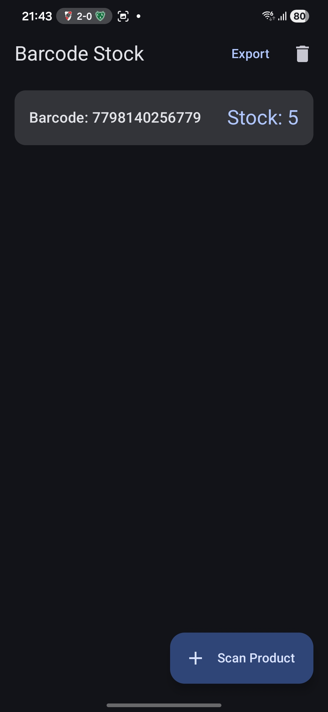
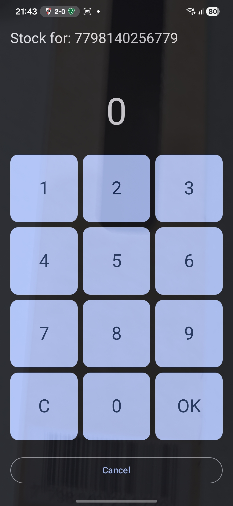

# Barcode Stock Control

Barcode Stock Control is an Android application designed for rapid inventory management. It allows users to quickly scan product barcodes and seamlessly enter stock quantities using a grid-style selector, optimizing the data entry process for maximum speed and efficiency.

## 📱 Features

- **Fast Barcode Scanning:** Initiate barcode scanning directly from the main screen.
- **Rapid Quantity Entry:** Immediately after a successful scan, a grid-based number selector appears, enabling lightning-fast quantity input without relying on the standard keyboard.
- **Continuous Workflow:** Once the stock quantity is confirmed and saved, the app automatically returns to the main screen, ready for the next scan.
- **Local Storage:** Fast and reliable local storage of your scanned inventory.

## 📸 Screenshots

  
  &nbsp;&nbsp;&nbsp;&nbsp;
  

## 🛠️ Tech Stack

This project is built using modern Android development practices:

- **Language:** [Kotlin](https://kotlinlang.org/)
- **UI Toolkit:** [Jetpack Compose](https://developer.android.com/jetpack/compose)
- **Architecture:** MVVM (Model-View-ViewModel)
- **Local Database:** [Room Database](https://developer.android.com/training/data-storage/room)
- **Camera & Scanning:** [CameraX](https://developer.android.com/training/camerax) / Barcode Scanning (via `BarcodeAnalyzer`)
- **Dependency Injection:** Hilt/Dagger (via `di` module)

## 🚀 Getting Started

1. Clone this repository.
2. Open the project in **Android Studio**.
3. Build and run the app on a physical Android device (a physical device is recommended for the camera and barcode scanner to work properly).

## 📄 License

This project is licensed under the MIT License.
